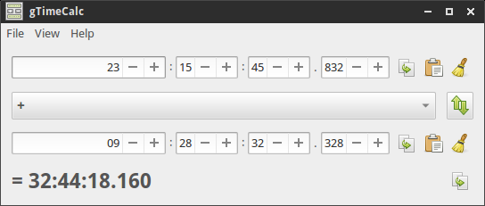
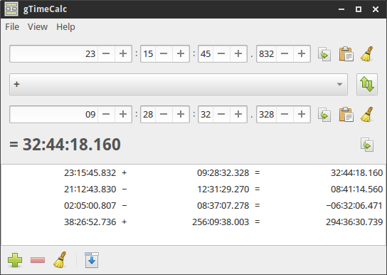
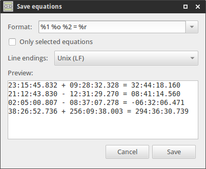

# About

gTimeCalc is an interactive calculator for time in `hh:mm:ss.ms`
format. It's a cross-platform, free, and open source software.

## Usage

### Pasting time

You can copy a time string from an any source and paste it to both of
time entries. The units of time can be separated by a colon, a Unicode
"RATIO" (U+2236), a comma, or any number of spaces and tabs. The last
component (seconds) is treated as a real number, others — as integers,
which means that fractional part, if any, will be truncated.

Time units in a string are parsed from right to left, so some of them,
as well as separators between, can be omitted. In this case, they will
be treated as zero. For example: `12:` and `00:12:00` is 12 minutes,
`:` is just zero.

The minus (ASCII hyphen (U+002D) or Unicode "MINUS SIGN" (U+2212)) is
allowed as well. For example, `1:−60` will be pasted as 0. But keep in
mind that the resulting time is always positive, so `1:−70` will be
pasted as 10 seconds.

Here are some examples:

String       | Pasted as
-------------|----------------------------------------------------------
`12:15:35.5` | 12 hours, 15 minutes, 35 seconds, 500 milliseconds
`12:15:`     | 12 hours, 15 minutes
`12:15`      | 12 minutes, 15 seconds
`12`         | 12 seconds
`−12`        | 12 seconds (the final time is always positive)
`.010`       | 10 milliseconds
`1:−60`      | 0 (1 minute minus 60 seconds)
`1:−70`      | 10 seconds (positive result of 1 minute minus 70 seconds)
`130:`       | 2 hours, 10 minutes
`3723`       | 1 hour, 2 minutes, 3 seconds

### Equation list

gTimeCalc has a list (select "View → Equations" to show it) in which
you can add equations from the calculator. To load the equation back,
click twice on it.

The "Save equation as…" button shows the dialog that allows you to
save the equation list as a plain text file in a custom format, e.g.
[CSV][] to open in a spreadsheet. The formatting is described in the
next section.

#### Formatting

The formatting works by replacing format specifiers in the format
string (the "Format" entry) with related information, such as a
component from the equation. Any text which is not a specifier remains
as is.

Here are all the format specifiers (you can also see them in the
pop-up tooltip of the Format entry):

Spec | Meaning
-----|-----------
`%1` | Time 1
`%2` | Time 2
`%o` | Operation
`%r` | Result
`%n` | Newline
`%t` | Tabulation
`%%` | %

For example, the format string to print a whole equation will be
`%1 %o %2 = %r`. To create a [CSV][] file, use `%1,%o,%2,%r` and
choose Windows (CRLF) line endings.

Several notes:

 *  For practical reasons, the text that replaces specifiers uses
    ASCII symbols instead of the Unicode ones. This means that time
    units will be separated by a colon (U+003A) instead of "RATIO"
    (U+2236), and the minus will be pasted as a hyphen (U+002D)
    instead of "MINUS SIGN" (U+2212).

 *  Each equation will be on a separate line. You don't have to add
    `%n` at the end of the format string for this.

 *  Using `%%` to insert the percent sign is only necessary when the
    sign and the following character create another specifier.

[CSV]: https://en.wikipedia.org/wiki/Comma-separated_values
